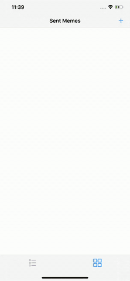

# MemeMev2.0
Udacity iOS Nanodegree Project

#### Summary 
MemeMe is a meme-generating app that enables a user to attach a caption to a picture from their phone. After adding text to an image chosen from the Photo Album or Camera, the user can share it with friends. MemeMe also temporarily stores sent memes which users can browse in a table or a grid.

The app has three pages of content:
 - Meme Editor View: Enables a user to add text to an image and share it. 
 - Sent Memes View: Enables a user to browse sent memes in a table or a grid.
 - Meme Detail View: Displays an image of a sent meme

Project Rubrics can be found [here](https://docs.google.com/document/d/1G2onkzN_weWmiYErhQJw1lB9-zxM-2TQ0N5bNMAaI7I/pub?embedded=true).

#### Requirements
- Xcode 11.4
- Swift 5

#### Implementation
- Use of UIKit
- Set up a navigation structure that creates an intuitive flow through the app
- Build tables with datasources and delegates
- Create custom table view cells
- Implement user interfaces with tab views and collection views
- The Meme Editor view has a toolbar with two buttons: one that allows user to open the Photo Album to select an image, one that launches the camera.
- The app displays the image picker when the Album button is pressed.
- The Camera button is disabled when app is run on devices without a camera, such as the simulator.
- The Meme Editor uses the Cancel button to return to the Sent Memes View.
- The app has a social share button that uses the “Action” icon built into iOS.
- The share button launches the Activity View.
- The meme is saved in the activity view controller’s `completionWithItemsHandler`. Canceling the activity view controller does not save the meme.
- The Meme model is a struct that includes:
  - two `strings` representing the top and bottom text
  - the original image
  - a memed image combining image and text
